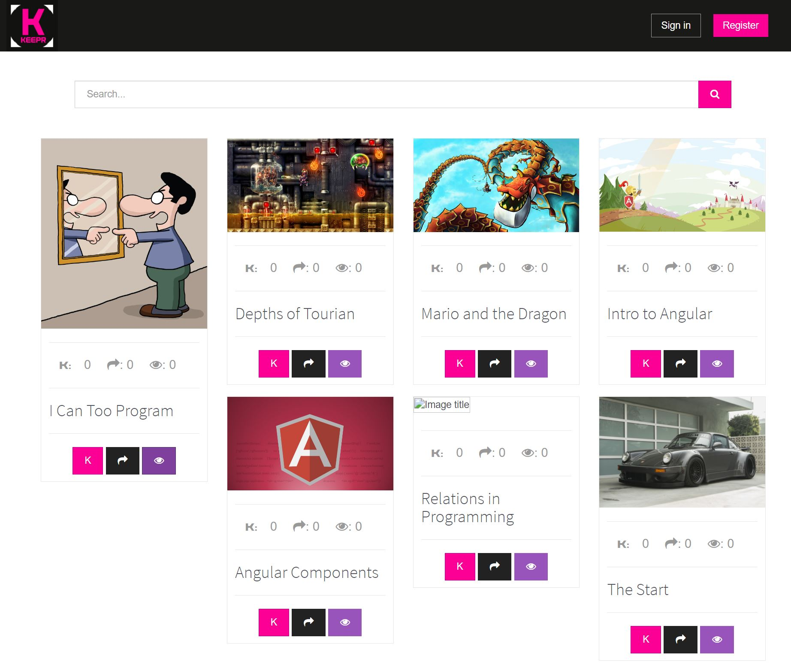
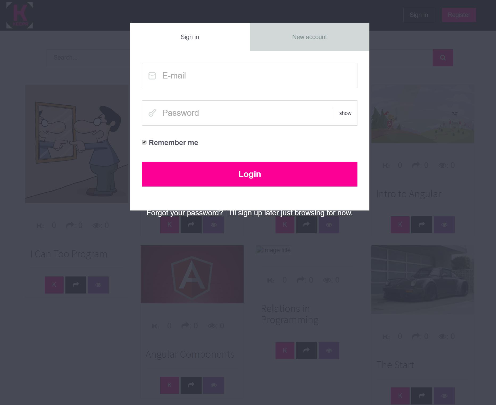
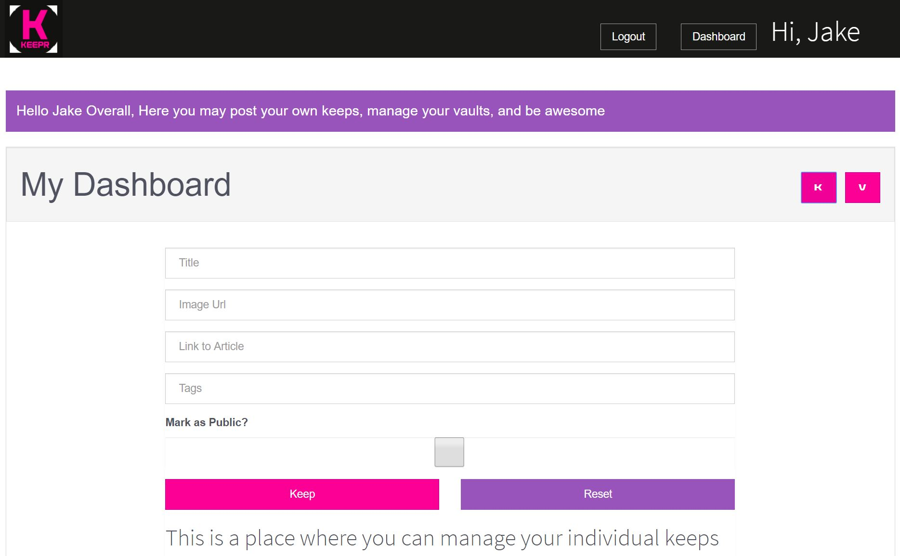
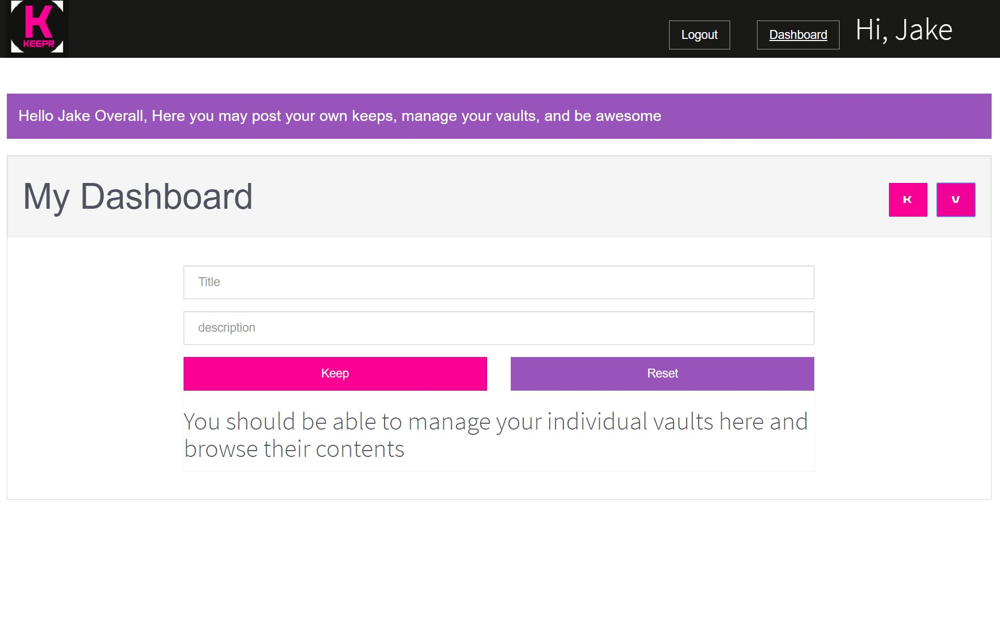

## Keepr

Keepr is a social network that allows users to visually share, and discover new interests by posting (known as 'keeping' on Keepr) images or videos to their own or others' collections (i.e. a collection of 'vaults,' usually with a common theme) and browsing what other users have kept. 

### The Setup

Keepr is a typical project where some of the basic layouts have been thought up but it's still missing some key components. The basic idea here is to allow users to post items if they are logged in. They can also browse all of the items (aka keeps) that have been posted without having to login. If any user wants to store a reference to any paticular keep they will store it in the `vault` of their choice. 

We want to give the users the opportunity to click on the keep icon for any post and have a list of their vaults appear. Selecting the vault should create a reference to that post and the users vault.

Vaults themselves are relatively simple... They only require a name and a description and will then have a list of posts that are saved within the vault. Think about how you will handle this relationship.

For example I may really like game art and thus I would be a user who creates a vault named ***Sweet Game Art*** I will then start saving the `keeps` I like into this vault.

The server you are using is a dotnet server with SqlServer and Entity Framework Identity. The user auth routes have already been created but you will be in charge of actually creating a user login/register form. 

### Step 1 -  Where is the output?

To get started you are going to need to create some models and think about the necessary relationships. Draw these out before you start coding.

The main goal here is to get users logging in and creating public posts (keeps). Once you are creating keeps you should be able to tackle the rest of the application.

Users will be allowed to create vaults where they can organize the posts of other users so they can recall the keeps they enjoy by looking at that paticular vault. 

> Remember that a single user can have many vaults but each vault will only belong to a single user.
Also a vault has many keeps and keeps could have many vaults but only one author or user... 

Also to make things more simplistic once a keep is marked public it can no longer be deleted.

### Step 2 - Adding the functionality

Once you get to the point where users can create vaults its time to put them to work. Users need a simple way to add a paticular keep to the vault of their choice while browsing. Also to give users some credit for creating excellent keeps lets keep track of the number of times a keep has been added to any vault. We also want to keep track of the number of views each keep gets.
 
### Step 3 - Prettify
What this site is already pretty if you follow the mocks :wink: Make sure the features you add are attactive.

### BONUS Ideas - Sharing the fun
- Keeps should be tagged. Make the site better by implementing a search filter.
- Write a few tests for your components.
- When a user clicks the share icon they should be able to post that share to the various social medias (Facebook, Twitter, ect) 

## Requirements
  #### Visualization: 
	- Users can see all public keeps
	- Anytime a `keep` is viewed or `kept in a vault` the relevant count should go up
	- Users can manage their keeps and vaults from a dashboard
	- When hovering over a keep show the three buttons from the bottom overlaid on the image and make 
		them clickable (View, Keep, Share... see below)
 #### Functionality:
	- Users can: 
		- Register and login 
		- Be automatically logged on page refresh
		- Create and manage their keeps
		- Create vaults to store their keeps
		- Add keeps to their individual vaults

### Deployment Time
When you are ready to push you site live you can simply run the `npm run build` command within your wwwsrc

This process will take your files from the **wwwsrc** directory and will minify them and put the minified files into your **wwwroot** directory

This happens because of a change to the **www/config/index.js** changing the build paths to match the path to root as opposed to the default 'dist' file

### Finished?
> We only grade the BUILT project. Make sure you test it. When You are finished submit your project to the gradebook

### Some inspirational mocks

	
	

	
	

	
	<hr/
	>
	

### Good Luck and Have Fun! 
